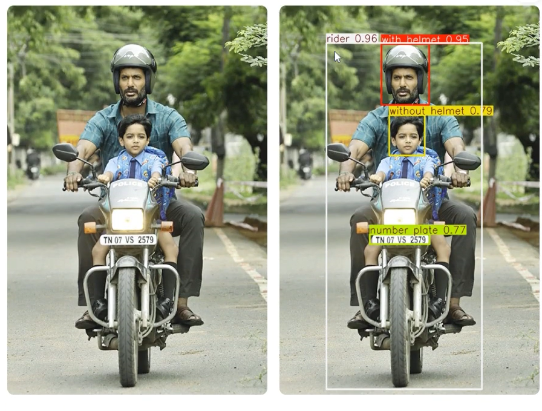
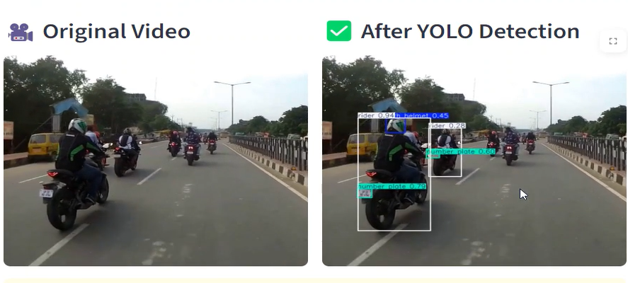

# 🪖 Helmet Detection App  

A **YOLOv11 + Streamlit** application for detecting helmets in **images** and **videos**.  
The app provides a simple interface where you can upload photos or videos,  
and instantly see the original input alongside the processed output with detections.  

---

## 🚀 Features
- 📷 Upload and analyze **images**.  
- 🎥 Upload and analyze **videos**.  
- ⚡ Powered by **YOLOv11** (Ultralytics).  
- 🖥️ Clean interface built with **Streamlit**.  
- 🔄 Side-by-side comparison: **Original vs Detected**.  

---

## 🛠️ Tech Stack
- Python 3.11+
- Streamlit
- Ultralytics YOLOv11
- OpenCV
- Pillow

---

## 📂 Project Structure
helmet-detection-app/
│── RiderSafety.ipynb        # My Notebook

│── helmet_app.py            # Main Streamlit app
│── requirements.txt         # Dependencies
│── README.txt               # Project documentation

---

## ⚙️ Installation & Usage

1. **Clone the repo**  
git clone https://github.com/Alaa37885/Helmet_Safety_Detection
cd helmet-detection-app

2. **Create virtual environment (recommended)**  
python -m venv env
source env/bin/activate   # Linux/Mac
env\Scripts\activate      # Windows

3. **Install dependencies**  
pip install -r requirements.txt

4. **Run the app**  
streamlit run helmet_app.py

---

## 📸 Screenshots  

### Image Detection  

|   |

### Video Detection  

|  |

---

## 📌 Example Use Cases
- 🏍️ Motorcycle helmet safety checks  
- 🏗️ Construction site monitoring  
- 🚦 Traffic surveillance  

---

## 🙌 Author
Developed by **[A'laa Omar Hamed](https://github.com/Alaa37885/Helmet_Safety_Detection)**  
🎯 Feel free to ⭐ star the repo if you find it useful!  
